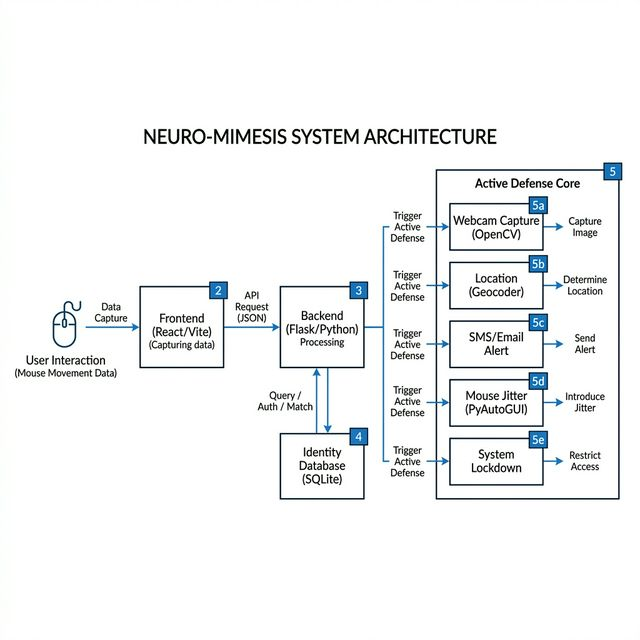

# Neuro-Mimesis: Cognitive Identity Verification Support System

[](https://opensource.org/licenses/MIT)
[](https://react.dev/)
[](https://www.python.org/)
[](https://vitejs.dev/)
[](https://tailwindcss.com/)

**Neuro-Mimesis** is a next-generation security framework designed to transcend the limitations of traditional passwords and static biometrics. It implements **Cognitive Identity Verification** by analyzing unique behavioral patterns—specifically mouse movement dynamics—to create a digital "fingerprint" of how a user interacts with their system.

> "The way you move a cursor is as unique as your DNA."

---

## 🚀 Overview

Traditional security measures (passwords, 2FA) are often vulnerable once an intruder gains physical access to an unlocked workstation. Neuro-Mimesis solves this through **Continuous Authentication**. Instead of verifying once at login, it monitors identity throughout the entire session. If an unauthorized user is detected, the system doesn't just log the breach—it initiates an **Active Defense Protocol** to neutralize the threat.

### Core Philosophy: "Mimesis"
The machine learns to "mimic" and recognize the user's specific cognitive-motor output. By calculating high-frequency mouse data (velocity, acceleration, jitter, and entropy), it maintains a real-time **Trust Score**.

---

## 🛠️ System Architecture



Neuro-Mimesis is built as a hybrid application, combining a high-performance OS-level background service with a premium web-based dashboard for visualization and management.

### 1. Frontend (React + Vite + TypeScript)
- **Enrollment Module**: Captures behavioral sequences to train the local identity model.
- **Live Dashboard**: Real-time visualization of Trust Scores, mouse heatmaps, and system status.
- **UI/UX**: Cyberpunk-inspired "High-Tech" design using Glassmorphism, Framer Motion, and Recharts.

### 2. Backend (Flask + SQLite)
- **Identity Store**: Securely stores hashed behavioral patterns and user profiles.
- **Auth Manager**: Handles session security and bridging the web interface with system-level hooks.

### 3. Active Defense Module (Python + OpenCV + PyAutoGUI)
- **The Guard**: A background service that monitors interaction and executes defense sequences when trust drops below the threshold.

---

## ⚡ Key Features

- **Behavioral Enrollment**: Record high-entropy mouse data to create a multi-dimensional "Cognitive Profile."
- **Continuous Trust Model**: Maintains a "Humanity Score" every second.
- **Intruder Detection**: AI-driven analysis of trajectories and jitter to identify unauthorized users.
- **Real-time Analytics**: Radar charts and heatmaps for transparency.
- **Cross-Platform Potential**: Ready for Electron deployment as a desktop application.

---

## 🛡️ The "Active Defense" Protocol

When a breach is detected (Trust Score falls below the threshold), the system triggers a 5-step response sequence:

1.  📸 **Evidence Capture**: Silently captures a high-resolution photo of the intruder via the webcam.
2.  📍 **Geo-Location Stalking**: Extracts IP-based GPS coordinates (Lat/Lng, City, Country).
3.  📡 **Emergency Broadcast**: Sends an automated alert via Email/SMS containing evidence and location.
4.  🌀 **Intruder Confusion**: Hijacks the mouse cursor with random jitter for 3 seconds, preventing malicious actions.
5.  🔒 **Hard Lockdown**: Force-locks the Windows workstation immediately.

---

## 🧪 Technology Stack

| Component | Technologies |
| :--- | :--- |
| **UI/UX** | React 19, Vite, Tailwind CSS 4, Framer Motion, Lucide |
| **Analytics** | Recharts, Mouse Entropy Analysis |
| **Backend** | Python 3.x, Flask, SQLite3 |
| **OS Control** | PyAutoGUI, Pypiwin32 (Windows API) |
| **Vision/Geo** | OpenCV (Webcam), Geocoder |

---

## ⚙️ Installation & Setup

### Prerequisites
- Node.js (v18+)
- Python (v3.9+)
- Windows OS (Required for `pypiwin32` hooks)

### 1. Clone the Repository
```bash
git clone https://github.com/yourusername/neuro-mimesis.git
cd neuro-mimesis
```

### 2. Backend Setup
```bash
# Create a virtual environment
python -m venv venv
source venv/bin/activate  # or venv\Scripts\activate on Windows

# Install dependencies
pip install -r requirements.txt
```

### 3. Frontend Setup
```bash
npm install
```

### 4. Running the Project
```bash
# Start the Backend & Security Module
python server.py

# Start the Frontend Dashboard
npm run dev
```

---

## 🗺️ Roadmap

- [ ] **Multi-Model Analysis**: Integrate keyboard typing dynamics and app usage patterns.
- [ ] **Zero-Trust Integration**: Enterprise-ready Active Directory support.
- [ ] **Deep Learning**: Implementation of Graph Neural Networks (GNN) for trajectory analysis.
- [ ] **Mobile Alerts**: Dedicated mobile app for remote lockdown and evidence viewing.

---

## 🤝 Contributing

Contributions are what make the open-source community such an amazing place to learn, inspire, and create. Any contributions you make are **greatly appreciated**.

1. Fork the Project
2. Create your Feature Branch (`git checkout -b feature/AmazingFeature`)
3. Commit your Changes (`git commit -m 'Add some AmazingFeature'`)
4. Push to the Branch (`git push origin feature/AmazingFeature`)
5. Open a Pull Request

---

## ⚖️ License

Distributed under the MIT License. See `LICENSE` for more information.

---

## 📧 Contact

**Project Lead**: V.Sadvik Kumar - vadlasadvik99@gmail.com
**Project Link**: [https://github.com/yourusername/neuro-mimesis](https://github.com/yourusername/neuro-mimesis)

---
*Created with ❤️ for the Cyber Security community.*
